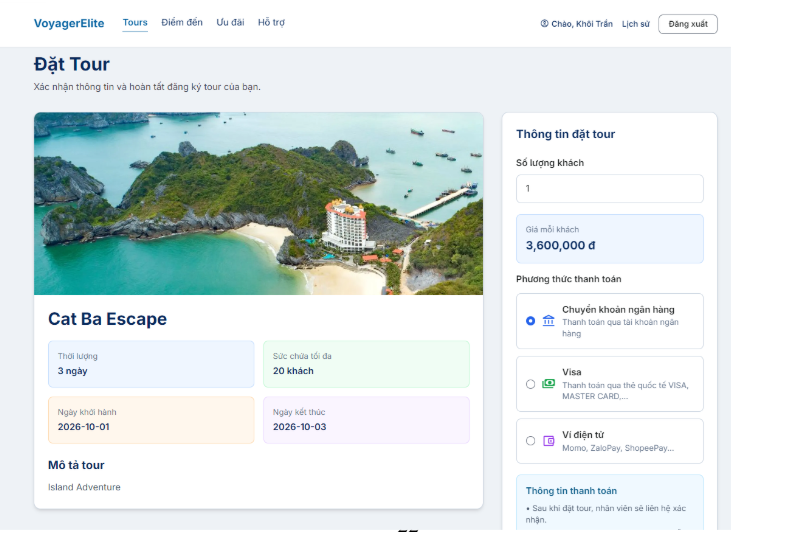
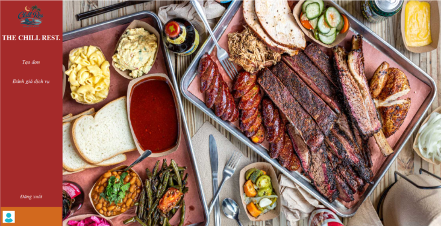

# 🌟 Tran Quoc Duy Khoi — Developer Portfolio

  <h3>👨‍💻 Java Backend Developer Intern</h3>
  
Passionate 3rd-year IT student at the <strong>University of Economics and Finance (UEF)</strong>, specializing in Java backend development, Spring Framework, and relational database management systems.

  

    
    
    
    
  

  

    
    
    
    
    
    
    
    
    
  

---

## 🎯 Career Objective

To develop my career as a **Java Backend Developer** by continuously improving my knowledge of Java, Spring Framework, database design, and high-performance server architectures. Actively seeking a **full-time internship** to gain practical industry experience, solve real-world problems, and contribute meaningfully to production software systems.

---

## 🛠️ Technical Skills

| Domain | Technologies & Competencies |
|:---|:---|
| **Core Languages** | Java (OOP, Collections, Stream API), C# |
| **Backend & Web** | Spring MVC, Spring Boot (Fundamentals), Servlet & JSP, RESTful Concepts |
| **Architecture** | Layered Architecture (Controller - Service - DAO - Model), MVC Pattern, CRUD Workflows |
| **Databases** | MySQL, Microsoft SQL Server, Relational Schema Design, Complex Queries |
| **Tools & Version Control** | Maven, Git, GitHub, GitHub Desktop, Visual Studio, IntelliJ IDEA, Eclipse |
| **Languages** | **English: VSTEP Level 7.0 (2026)** \| IELTS Band 5.5 (2022) |

---

## 🚀 Featured Projects

### 1. VoyagerElite — Travel Tour Booking System
> **Academic Group Project** • Role: *Booking & Payment Module Lead*  
> **Source Code:** [vannld23/travel-tour-booking-system](https://github.com/vannld23/travel-tour-booking-system)

  

- **Tech Stack:** Java, Spring MVC, Servlet & JSP, MySQL, Apache Maven.
- **Architectural Pattern:** Strict MVC Layered Architecture (`Controller` $\rightarrow$ `Service` $\rightarrow$ `DAO` $\rightarrow$ `Model`).
- **Key Contributions:**
  - Architected and implemented the end-to-end booking flow: booking creation, validation, history retrieval, and status life-cycle (`Pending` $\rightarrow$ `Confirmed` $\rightarrow$ `Completed` $\rightarrow$ `Cancelled`).
  - Implemented transactional database operations for booking and customer records with MySQL.
  - Handled modular payment tracking and administrative audit logging.

---

### 2. The Chill Rest. — Restaurant Management System
> **Academic Group Project**  
> **Source Code:** [DuyKhoi282/Restaurant-App](https://github.com/DuyKhoi282/Restaurant-App)

  

- **Tech Stack:** C#, .NET WinForms, Microsoft SQL Server, EPPlus.
- **Key Features:**
  - Comprehensive desktop Point-of-Sale (POS) application for menu, table, and order administration.
  - Dynamic CRUD operations for food categories and menu items with real-time image caching.
  - Multi-criteria real-time search, price filtering, and category sorting.
  - Automated business report generation and Excel spreadsheet export via EPPlus library.

---

## 🎓 Education & Certifications

- **University of Economics and Finance (UEF)**
  - *Bachelor of Information Technology* (2023 – Expected 2027)
  - Year 3 Student • Focused on Software Engineering & Backend Architecture
- **Certifications & Honors:**
  - 🏅 **Consolation Prize** — Cybernet Competition 2025 (UEF)
  - 🌐 **VSTEP English Proficiency Level 7.0** (2026)
  - 🌐 **IELTS Academic Overall 5.5** (2022)

---

## 👨‍🏫 Reference

- **Dr. Hoang Van Hieu**
  - Lecturer, Faculty of Information Technology — *University of Economics and Finance (UEF)*
  - 📧 Email: [hieuhv@uef.edu.vn](mailto:hieuhv@uef.edu.vn)

---

## 📬 Contact & Connect

Feel free to connect with me for internship opportunities or technical discussions:

- 📱 **Phone:** [0929 648 427](tel:0929648427)
- ✉️ **Email:** [tranquocduykhoi@gmail.com](mailto:tranquocduykhoi@gmail.com)
- 🐙 **GitHub:** [@DuyKhoi282](https://github.com/DuyKhoi282)
- ⚡ **Live Website:** [duykhoi-portfolio.netlify.app](https://duykhoi-portfolio.netlify.app/)
- 🌐 **GitHub Mirror:** [DuyKhoi282.github.io/portfolio-github](https://DuyKhoi282.github.io/portfolio-github/)

---

  Built with clean HTML5, CSS3 & JavaScript • Hosted on Netlify & GitHub Pages • Designed for ATS compliance and clean aesthetics

